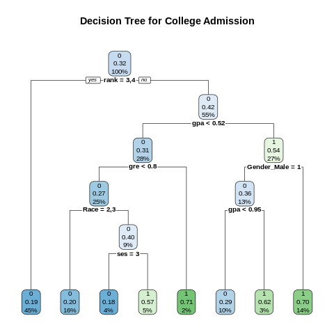
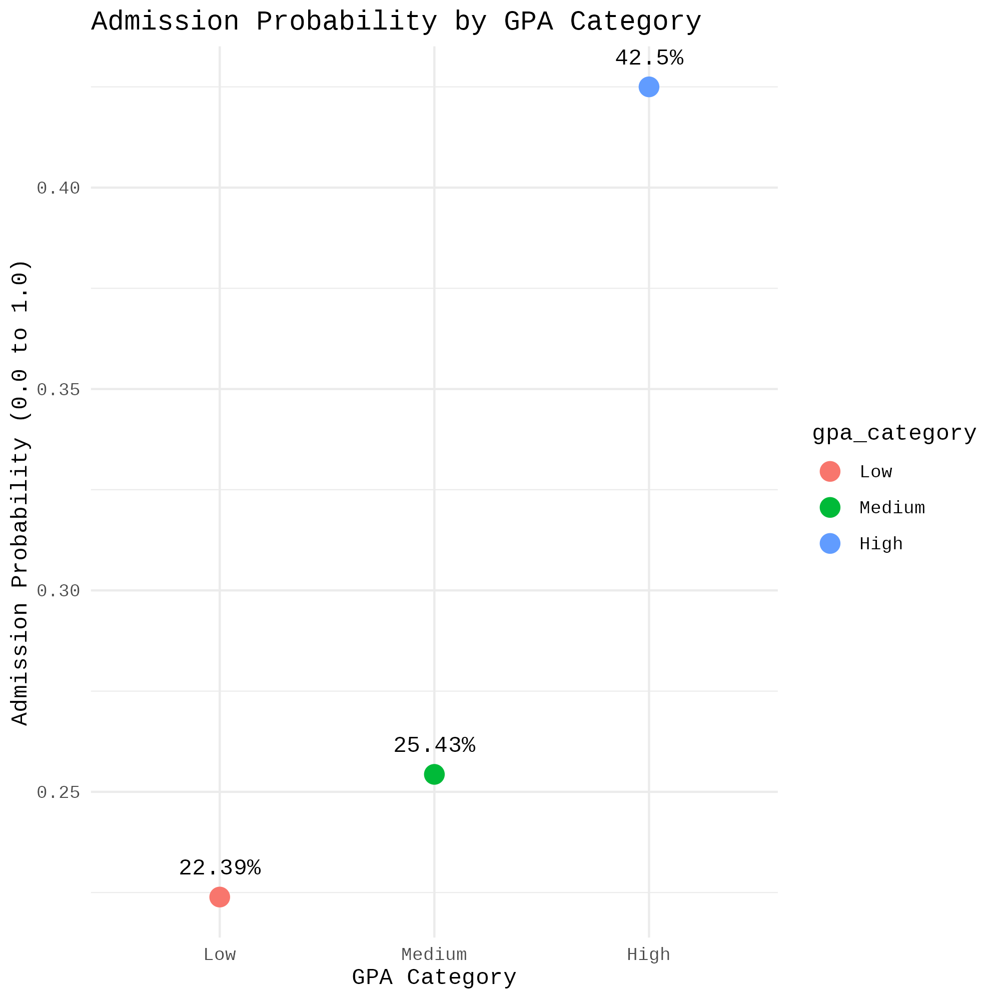
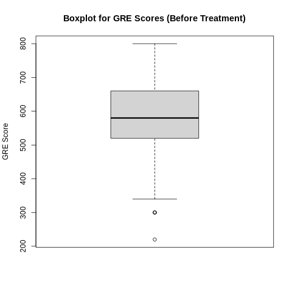
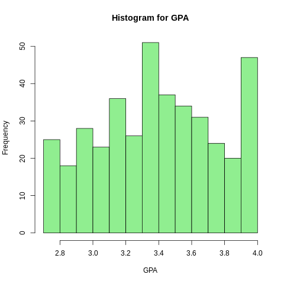

<!-- =============================
   SHOW-STOPPER ANIMATED README HEADER
   Paste this at the top of README.md
   Replace banner.gif with your own animated GIF in /assets if desired
   ============================= -->

<div align="center" style="margin-top:6px;">

<!-- Title -->
<h1 style="margin-bottom:6px; font-size:46px; line-height:1; letter-spacing: -1px;">
  <strong>College Admission Analysis</strong>
</h1>

<!-- Subheading with subtle gradient text using an inline SVG image (typing effect below adds motion) -->
<p style="margin-top:0; margin-bottom:8px; font-size:18px; color:#6b7280;">
  Predict • Explain • Recommend — academic admissions decoded with data & models
</p>

<!-- Animated typing summary (dynamic lines) -->
<p>
  
</p>

<!-- Badge row (glossy) -->
<p>
  
  
  
  
</p>

<!-- Cinematic animated banner GIF (replace src with assets/banner.gif for your own) -->
<p>
  
</p>

<!-- Layered mini-cards (floating effect) -->
<p>
  
  
  
</p>

<!-- Punch line -->
<p style="margin-top:12px; font-size:15px; color:#94a3b8; max-width:900px;">
  <em style="color:#0ea5e9">One-click walkthrough:</em> clean data → engineered features → validated models → actionable insights.  
  Built to explainable standards — ready for presentations and reproducible research.
</p>

</div>


## 🏛️ Background and Objective
Every year, thousands of applications are submitted by international students for admission to colleges in the USA. It becomes an iterative task for the Education Department to know the total number of applications received and then compare that data with the total number of applications successfully accepted and visas processed.

**The objective of this exercise is to analyze the historical data and determine the key drivers for admission.**

## 📊 Dataset Description
The analysis is based on the following dataset, which includes academic, demographic, and institutional factors.

| Attribute | Description |
| :--- | :--- |
| **GRE** | Graduate Record Exam Scores |
| **GPA** | Grade Point Average |
| **Rank** | Prestige of the undergraduate institution (1=Highest, 4=Lowest) |
| **Admit** | **Response Variable:** 1 = Admitted, 0 = Not Admitted |
| **SES** | Socioeconomic Status (1=Low, 2=Medium, 3=High) |
| **Gender_male** | 0 = Female, 1 = Male |
| **Race** | 1, 2, or 3 (representing Hispanic, Asian, and African-American) |

---

## 📈 Analysis Tasks & Methodology
The project is divided into predictive modeling and descriptive analysis.

### 1. Predictive Analysis
* **Data Cleaning:** Identified and treated missing values and outliers.
* **Data Transformation:** Converted data types, checked for normal distribution (using Q-Q plots), and applied normalization.
* **Feature Selection:** Used variable reduction techniques to identify significant predictors.
* **Modeling:**
    1.  **Logistic Regression:** Built a model to determine the core factors influencing admission.
    2.  **Decision Tree:** Built a tree-based model for interpretability.
    3.  **Support Vector Machine (SVM):** Built an SVM model.
* **Validation:** Calculated model accuracy, ran validation techniques, and selected the champion model.

### 2. Descriptive Analysis
* Categorized the average of grade point into High, Medium, and Low with admission probability percentages.
* Created a cross-grid for admission variables with GRE categorization:
    * **Low:** 0-440
    * **Medium:** 440-580
    * **High:** 580+

---

## 🖼️ Key Visualizations
Below are a few key plots from the analysis. All plots generated by the scripts are available in the `images/` folder.

**[➡️ Click here to see all 10 images](images/)**

| Decision Tree Model | GPA Admission Probability |
| :---: | :---: |
|  |  |

| Outlier Treatment (Example: GRE) | Data Distribution (Example: GPA) |
| :---: | :---: |
|  |  |

---

## 📁 Repository Structure & File Links
* **[`data/`](data/):** Contains the raw data used for this analysis.
* **[`reports/`](reports/):** Contains the final project reports in PDF and DOCX format.
    * [`reports/College_Admission_Analysis_Report.pdf`](reports/College_Admission_Analysis_Report.pdf)
* **[`images/`](images/):** Contains all 10 plots and visualizations generated by the R scripts.
* **[`scripts/`](scripts/):** Contains all the R scripts for the analysis.
    * **[`scripts/00_run_all_analysis.R`](scripts/00_run_all_analysis.R):** A master script to run the entire analysis.
    * **[`scripts/01_plot_decision_tree.R`](scripts/01_plot_decision_tree.R):** Code to generate the decision tree plot.
    * **[`scripts/02_plot_gpa_prob.R`](scripts/02_plot_gpa_prob.R):** Code for the GPA probability plot.
    * *...and 8 other scripts for each specific plot.*

---

## 🚀 How to Run This Project
1.  Clone this repository to your local machine:
    ```bash
    git clone [https://github.com/mohithgaru/College_Admission_Analysis_R.git](https://github.com/mohithgaru/College_Admission_Analysis_R.git)
    ```
2.  Open the project in RStudio by double-clicking the `College_Admission_Analysis.Rproj` file.
3.  Install the required packages. You can do this by running:
    ```r
    install.packages(c("ggplot2", "dplyr", "rpart", "rpart.plot", "e1071", "caret"))
    ```
4.  Run the master script to perform the full analysis and generate all plots:
    ```r
    source("scripts/00_run_all_analysis.R")
    ```
5.  Alternatively, run each script in the `scripts/` folder in numerical order.


